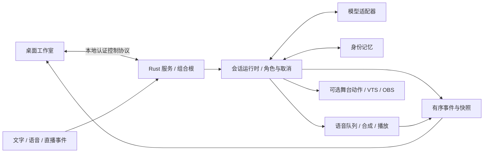

# AIex

一个 Windows 优先、以 Rust 为核心的本地数字伙伴工作室。人格、记忆和表现相互独立：同一个角色可以使用原生人物立绘、自定义图片，也可以隐藏外形或连接 VTube Studio。

当前版本：**0.7.1-alpha.1 · 架构与维护整理**。[版本说明](docs/releases/0.7.1-alpha.1.md)记录本次维护变化及验证；[演进路线](docs/DIGITAL_HUMAN_ROADMAP.md)记录后续设计。

**首次体验只需完整解压程序包，双击 `AIex.exe`。** 无需安装 Rust、Python 或 VTube Studio。[整体验收流程](docs/MANUAL_TEST_PLAN.md)从界面操作开始。

[下载 Windows 便携包](https://github.com/QwQBiG/AIA/releases/download/v0.7.1-alpha.1/AIex-Windows-x64-0.7.1-alpha.1.zip) · [查看发布与校验文件](https://github.com/QwQBiG/AIA/releases/tag/v0.7.1-alpha.1)

## 这次维护更新

0.7.1 整理了各页面共用的界面模块，强化包名、路径与依赖方向检查，并补齐[项目目录](docs/PROJECT_LAYOUT.md)和维护入口。人物、对话、场景与记忆流程保持一致，现有数据格式继续沿用。

## 自己的 OC，放在第一位

项目作者的 OC 成为默认的“一号人物”：银灰短发、灰紫眼睛与淡紫领结，支持半身和全身展示。主立绘直接内置在 `AIex.exe` 中，无需下载或导入。原来的“初始伙伴”、自定义 PNG/JPEG 图片角色和隐藏外形仍可选择；换外形不会改动人格或记忆。

离线预览的 OC 素材册可翻看正式立绘、六表情参考，以及欢迎、专注、完成庆祝和温柔鼓励四张动作图。素材册是独立的静态参考，不会替换正在使用的外形。人物选择和构图可随场景保存，并恢复为启动组合；旧场景继续使用原来的初始伙伴。

一号人物使用独立校准的眨眼、说话局部贴层和轻微呼吸；其他情绪以状态文字提示，六表情参考图不会自动切换。这是插画展示，不是 Live2D 或骨骼动画。暖白与淡紫工作区、固定输入区、[记忆工作台](docs/MEMORY_WORKSPACE.md)和角色收藏继续沿用。先按[五分钟外形体验](docs/MANUAL_TEST_PLAN.md)查看效果，再接入自己的模型。

## 可以做什么

| 能力 | 当前实现 |
| --- | --- |
| 自定义角色 | 新建、独立复制、收藏多个版本、导入导出、预览确认后应用 |
| 记忆工作台 | 按角色查看、新建确认笔记、更正与单条遗忘；换外形不换身份 |
| 多种外形 | 两位内置人物、OC 半身/全身与素材册、PNG/JPEG 表情组、隐藏外形；VTS 可选 |
| 组合场景 | 保存角色、人物选择和构图，图片随包携带；支持启动时恢复已选组合 |
| 对话与打断 | 三种模型适配器、流式回答、有界排队、慢模型和语音拥堵时取消 |
| 声音与表达 | 配置 GPT-SoVITS 后朗读；原生字幕、情绪与能量口型跟随实际播放 |
| 故障恢复 | 断线重同步、外形输出降级、停止期间保护已开始的记忆写入 |
| 可选输入与扩展 | Whisper 兼容转写、原生采集、Bilibili、OBS、插件与只读视觉分析 |

网页、桌面悬浮窗口、VRM 3D、图形化声音/行为包编辑器尚未实现。场景包目前组合角色与外形，模型凭据、声音配置和私人记忆不随包导出。Windows 自动化动作适配器尚未启用。


使用示例对话进行离屏渲染。人物与聊天并排，舞台装饰色和外形可自行调整。

## 快速开始

1. 将 `AIex-Windows-x64-0.7.1-alpha.1.zip` 完整解压到可写入的文件夹。
2. 双击其中的 **`AIex.exe`**，点击 **“先体验外形”**。先看一号人物，切换半身/全身，展开 **“OC 素材册”** 翻看原画。无需账号或模型；也可选择初始伙伴或导入自己的图片外形。
3. 直接在预览底部点击 **“开始对话”**，按界面填写模型连接信息并保存。预览中的外形会沿用，后台服务已随包提供，会自动启动。

主窗口分为 **聊天 / 角色与外形 / 场景组合 / 记忆 / 设置与诊断**。输入区支持 Enter 换行，Ctrl+Enter 或“发送”提交；中文输入法确认候选不会直接发送。连接设置中的“启用长期记忆”保存后重启服务生效，关闭不会删除原记录。要修改模型或回到离线预览，在设置页进入“连接设置”或“首页”。

真实对话需要自己的云端密钥，或已经运行的 Ollama / KoboldCpp。模型和声音资源没有内置；语音、麦克风、VTS、OBS 默认关闭。云端密钥只在本次进程中使用；未设置对应环境变量时，下次打开会再次进入连接设置。

便携包中 `AIex.exe`、`ai-ex-service.exe`、`AIex.portable` 和 `data` 必须一起保留。配置与记忆保存在 `data`，后台日志在 `data/logs/service.log`。外形偏好和角色收藏仍有本机设置，跨电脑请先导出场景或角色包。详见[便携版使用说明](docs/PORTABLE_WINDOWS.md)。

### 从源码运行或制作程序包

<details>
<summary>开发者构建步骤（使用便携包可跳过）</summary>

以下命令在仓库根目录的 PowerShell 中执行。源码需要 **Rust 1.96 或更新的兼容版本**及对应工具链的 Windows 链接器；首次构建需要下载依赖。

### 1. 构建两个程序

```powershell
cargo build -p ai-ex-service --all-features --locked
cargo build --manifest-path crates/ai-ex-desktop/Cargo.toml --locked
```

核心 workspace 和独立桌面包分别构建。构建只准备程序，语音输出与麦克风是否启用仍由配置控制。

### 2. 先预览外形

```powershell
& .\crates\ai-ex-desktop\target\debug\ai-ex-desktop.exe --preview
```

此模式无需模型、语音服务或 VTube Studio，可以切换内置外形和手动预览表现。自定义立绘见[图片外形包](docs/APPEARANCE_PACKS.md)。

### 3. 设置并开始对话

```powershell
& .\crates\ai-ex-desktop\target\debug\ai-ex-desktop.exe
```

无参数运行先显示欢迎页；选择连接模型后进入设置向导。选择一个已准备好的模型服务，填写模型名称或凭据，勾选“打开 AIex 时自动启动服务”，保存后连接。已有配置可用 `--setup` 重新编辑。

日常也可双击 `AIex-Desktop.cmd`；它优先选择 release 程序，其次 debug。**源码验收使用上面的明确路径，避免旧 release 程序遮住刚构建的 debug 版本。** 若程序旁边放有服务二进制，也应同步更新。

- 日常配置：`config/ai-ex.local.toml`；首次设置生成控制令牌，不需要手工填写令牌内容。
- DeepSeek 密钥只在当前设置进程中使用，或从配置指定的环境变量读取，不写入 TOML。重开程序时需重新提供环境变量或通过设置填写。
- 桌面新启动的服务随桌面退出；复用已运行且认证成功的服务时，关闭桌面保留该服务。
- 修改配置后需重启对应服务。相对资源路径按启动工作目录解释，因此从仓库根目录运行。

详细入口、服务模式与诊断见[桌面指南](docs/DESKTOP_USER_GUIDE.md)。独立测试配置与测试端口见[验收流程](docs/MANUAL_TEST_PLAN.md)。

制作同样的便携包（PowerShell 7）：

```powershell
./tools/package_windows.ps1
```

脚本构建 release、检查程序包并在 `dist/` 生成 ZIP 与 SHA256。已有目标会拒绝覆盖；`-Offline` 使用已缓存依赖。仅在已完成对应 release 构建时使用 `-SkipBuild`。

</details>

## 按需连接外部能力

| 目标 | 需要准备什么 | 说明 |
| --- | --- | --- |
| 文字对话 | DeepSeek、Ollama 或 KoboldCpp 中任意一种 | 按服务实际支持的模型填写；见[模型后端](docs/MODEL_BACKENDS.md) |
| 语音朗读 | GPT-SoVITS、可访问的参考音频及匹配提示文本 | 启用 `[tts]`；见[声音与表达](docs/SPEECH_PRESENTATION.md) |
| 麦克风对话 | Whisper 兼容 HTTP 转写服务和输入设备 | 启用 `[duplex]`；先验收文字与播放，再测试采集 |
| VTS / OBS | 对应应用及其接口配置 | 原生外形无需它们；VTS/OBS 仍按生成动作调度 |
| 直播输入 | Bilibili 房间及连接配置 | 默认关闭；见[直播连接](docs/BILIBILI_CONNECTOR.md) |

外部模型、语音服务与资源不随项目内置。健康检查会访问配置的外部服务，不是纯离线检查；返回退出码 1 时应查看具体不可用组件。模型不可用时不能完成对话；可选外形不可用时可以降级。

## 整体架构



服务持有会话状态；桌面通过协议提交意图、读取快照并绘制外形。生成进度和实际播放进度分别管理。角色、外形和场景清单共用配置校验，不绑定某个模型或渲染引擎。

完整模块职责、依赖方向、数据流、取消边界及扩展方式见 **[架构说明](docs/ARCHITECTURE.md)**；源码、资源与历史内容的归属见 **[项目目录](docs/PROJECT_LAYOUT.md)**。架构检查同时覆盖 30 个 workspace 包与独立桌面包。

## 数据与配置

| 数据 | 归属与保存方式 |
| --- | --- |
| 服务初始配置 | TOML；保存模型引用、初始角色、功能开关和本机路径 |
| 角色包 / 外形包 / 场景包 | 角色与外形包为 schema v1；场景兼容 v1，含内置人物选择时使用 v2；详见对应文档 |
| 私人记忆 | 服务配置的 JSONL 文件，按 `profile_id` 逻辑隔离 |
| 收藏 / 外形偏好 / 启动组合 | 本机桌面设置；收藏可跨服务复用，启动组合按配置路径和控制地址区分 |
| 密钥 / 控制令牌 | 环境变量或本机令牌文件，不随组合包导出 |

记忆保存在本机，但召回片段会随对话上下文交给所选模型；使用云模型时，这部分请求会发送到对应服务。角色身份隔离不是文件加密。默认目录中新生成的 Rust JSONL 记忆已排除提交；自定义数据路径需自行确认忽略规则。测试资料请使用验收流程指定的独立目录。

## 验证与文档

[整体验收流程](docs/MANUAL_TEST_PLAN.md)提供简短体验清单，以及可展开的深度检查和故障记录方法。自动验证范围见[本版说明](docs/releases/0.7.1-alpha.1.md)；真实窗口操作和音频设备仍需整机验收。

- [角色收藏](docs/CHARACTER_LIBRARY.md) · [角色包](docs/CHARACTER_PACKS.md) · [图片外形](docs/APPEARANCE_PACKS.md) · [场景组合](docs/SCENE_PACKS.md)
- [记忆工作台](docs/MEMORY_WORKSPACE.md) · [人格与记忆](docs/PERSONA_MEMORY.md) · [控制协议](docs/CONTROL_PROTOCOL.md) · [插件协议](docs/PLUGIN_PROTOCOL.md)
- [开发约定](CONTRIBUTING.md) · [文档索引](docs/README.md) · [后续路线](docs/DIGITAL_HUMAN_ROADMAP.md)

旧 `main.py`、`src/` 和 Python 文档保留为历史行为参考，不属于当前 Rust 启动路径；迁移记录见[技术基线](docs/CORE_TECHNICAL_BASELINE.md)与[退役计划](docs/LEGACY_RETIREMENT.md)。
